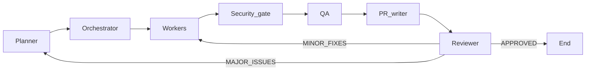

# AI Team Orchestration

This repository uses a **modular, configuration-first** playbook. **Agents** describe roles, **skills** describe reusable capabilities, **rules** encode planning/orchestration/execution logic, and **guardrails** apply global constraints. **[AGENTS.md](AGENTS.md)** (this file) is the **index and narrative specification**; detailed behavior lives in the linked files under [.cursor/](.cursor/).

---

## Configuration layout


| Layer          | Location                                                                   | Purpose                                                                                                                                                                                                                                                                                                            |
| -------------- | -------------------------------------------------------------------------- | ------------------------------------------------------------------------------------------------------------------------------------------------------------------------------------------------------------------------------------------------------------------------------------------------------------------ |
| **Agents**     | [.cursor/agents/](.cursor/agents/)                                         | Role behavior: responsibilities, I/O, constraints (**no embedded skill→worker maps**).                                                                                                                                                                                                                             |
| **Skills**     | [.cursor/skills/](.cursor/skills/)                                         | Reusable capability modules as **`*.md`** files (routing defaults + workflow skills). Canonical catalog: [Skills catalog](#skills-catalog) below and [`.cursor/skills/README.md`](.cursor/skills/README.md).                                                                                                              |
| **Rules**      | [.cursor/rules/](.cursor/rules/)                                           | Planning, orchestration, execution policy. **Always-on Cursor rule:** [ai-team-orchestration.mdc](.cursor/rules/ai-team-orchestration.mdc).                                                                                                                                                                        |
| **Guardrails** | [.cursor/guardrails/](.cursor/guardrails/)                                 | Cross-cutting safety and quality limits. **[require-plan-approval](.cursor/guardrails/require-plan-approval.md)** (critical): no `Task` until plan is approved. **[enforce-atomic-parallelism](.cursor/guardrails/enforce-atomic-parallelism.md)** (high): atomic tasks + parallel dispatch (one `Task` per task). |
| **Hooks**      | [.cursor/hooks.json](.cursor/hooks.json), [.cursor/hooks/](.cursor/hooks/) | Cursor **command hooks** (e.g. shell after `git push`)—**not** AI agents; they run scripts only.                                                                                                                                                                                                                   |
| **Commands**   | [.cursor/commands/](.cursor/commands/)                                     | **Slash-command** prompts for Cursor (lifecycle + PR/docs/Jira helpers); each file is one command. See [Cursor commands](#cursor-commands).                                                                                                                                                                          |


**Routing:** The planner declares **required skill modules** per task; the **orchestrator** assigns **executing agents** using [orchestration-rules.md](.cursor/rules/orchestration-rules.md) (single place for skill→role defaults and isolation rules).

**Self-healing:** Review can route to **targeted worker re-runs** (`MINOR FIXES`) or **replanner + re-orchestration** (`MAJOR ISSUES`), with **maximum 2 repair iterations** per feature slice ([guardrails](.cursor/guardrails/guardrails.md)).

---

## Human-in-the-loop approval

**Execution flow:** **Planner** → **wait for approval** → **Orchestrator** → **workers** (via `Task`).

1. **planner-agent** emits a `**PLAN:`** (skills + dependencies per [planning-rules.md](.cursor/rules/planning-rules.md)), then `**STATUS: WAITING_FOR_APPROVAL`** and `**INSTRUCTION:`** for next steps ([planner-agent.md](.cursor/agents/planner-agent.md)).
2. The user may:
  - **Approve** — explicit intent (e.g. approve / go ahead / run / proceed / lgtm). Then **orchestrator-agent** may build `**PARALLEL:`** / `**SEQUENTIAL:`** and dispatch `**Task`**.
  - **Request changes** — describe edits; **planner-agent** updates only what is asked, re-emits the **full** revised `PLAN:`, returns to `**WAITING_FOR_APPROVAL`**. **No execution** until a new approval.
  - **Reject** — **planner-agent** produces a **new plan from scratch**, then `**WAITING_FOR_APPROVAL`** again.

**Rules:**

- **No execution without approval** — [require-plan-approval.md](.cursor/guardrails/require-plan-approval.md) blocks `**Task`** if `STATUS: WAITING_FOR_APPROVAL` is active without explicit approval, or if the user asked for plan changes but has not re-approved ([orchestrator-agent.md](.cursor/agents/orchestrator-agent.md)).
- **Iterative refinement** of the plan is allowed and expected before any parallel worker runs.
- **Post-review repair** batches also require **explicit user authorization** to run the next `**Task`** wave unless the session clearly already approved that work (see orchestrator-agent).

---

## Atomic task execution

- Tasks must be split into the **smallest independent units** that still make sense to implement and review ([planner-agent.md](.cursor/agents/planner-agent.md), [enforce-atomic-parallelism.md](.cursor/guardrails/enforce-atomic-parallelism.md)).
- **Independent** tasks (no dependency edges between them, no conflicting mutable ownership) **must** be scheduled in `**PARALLEL:`** and executed in parallel when tooling allows—not serialized “to be safe.”

### Same-agent parallelism

The orchestrator resolves **skills → agent role** per task. If multiple tasks map to the **same** role (e.g. three tasks all → `backend-developer`) and they are **independent**:

- Spawn **separate** subagents: **one `Task` invocation per task** (e.g. three parallel `Task` calls in one turn).
- **Never** reuse a **single** subagent run to implement several independent planned tasks at once.
- **Never** batch independent deliverables into one task in the `PLAN:` just to avoid multiple `Task` calls.

**Example:** Three backend tasks A, B, C with no mutual dependencies → `**PARALLEL:`** with three lines, each `**Assigned agent: backend-developer`**, each a distinct `**Task`** (three parallel subagents). See [orchestrator-agent.md](.cursor/agents/orchestrator-agent.md).

**Exceptions:** True dependencies, shared file/module exclusivity, and **mandatory phase order** (e.g. security gate before QA) still force **sequential** edges—see [orchestration-rules.md](.cursor/rules/orchestration-rules.md).

---

## Agent architecture

All subagents are invoked by the controller via Cursor’s `**Task` tool** (see [Cursor mapping](#cursor-mapping-task-tool-and-parallelism)). Agent **definitions** are files under `.cursor/agents/`; the `**name:`** in each file’s YAML frontmatter is the subagent type string used when dispatching.


| Agent                  | File                                                          | Role (summary)                                                                                                                                                                        |
| ---------------------- | ------------------------------------------------------------- | ------------------------------------------------------------------------------------------------------------------------------------------------------------------------------------- |
| **planner-agent**      | [planner-agent.md](.cursor/agents/planner-agent.md)           | `**PLAN:`** with **atomic** tasks + `**WAITING_FOR_APPROVAL`**; skills only (no worker names); splits independent work.                                                               |
| **orchestrator-agent** | [orchestrator-agent.md](.cursor/agents/orchestrator-agent.md) | After approval: `**PARALLEL:`** / `**SEQUENTIAL:`**, `**Assigned agent:`**; **one `Task` per task** (parallel same-role OK); **blocks `Task`** until approved.                        |
| **backend-developer**  | [backend-developer.md](.cursor/agents/backend-developer.md)   | Backend implementation worker.                                                                                                                                                        |
| **frontend-developer** | [frontend-developer.md](.cursor/agents/frontend-developer.md) | Frontend implementation worker.                                                                                                                                                       |
| **data-engineer**      | [data-engineer.md](.cursor/agents/data-engineer.md)           | Data pipelines / warehouse / engineering surfaces.                                                                                                                                    |
| **data-scientist**     | [data-scientist.md](.cursor/agents/data-scientist.md)         | ML / experimentation / model-related work.                                                                                                                                            |
| **data-analyst**       | [data-analyst.md](.cursor/agents/data-analyst.md)             | Analytics, BI, reporting.                                                                                                                                                             |
| **security-engineer**  | [security-engineer.md](.cursor/agents/security-engineer.md)   | **Security audit** (input handling, authn/z, data protection, infrastructure, third parties); severities **Critical→Info**; **Security Audit Report** + **SECURITY GATE RESULT** **CLEAR** / **BLOCKED** before QA. |
| **qa-engineer**        | [qa-engineer.md](.cursor/agents/qa-engineer.md)               | **Test strategy**, writing tests, **coverage analysis**, **Prove-It** bugs; unit vs integration vs E2E; **Test Coverage Analysis** template; **only after** security **CLEAR**. |
| **pr-writer-agent**    | [pr-writer-agent.md](.cursor/agents/pr-writer-agent.md)       | PR **create vs update**, `**featureKey`**, draft defaults, title/body (Git-native; **not** the same as reviewer).                                                                     |
| **reviewer-agent**     | [reviewer-agent.md](.cursor/agents/reviewer-agent.md)         | **Senior / PR review** across **correctness, readability, architecture, security, performance**; findings as **Critical / Important / Suggestion**; emits `**REVIEW RESULT`**; **posts** structured summary to **GitHub PR** (also **PR reviewer** / **pr-reviewer-agent**). |


**Worker pool:** `backend-developer`, `frontend-developer`, `data-engineer`, `data-scientist`, and `data-analyst` are the **implementation** workers. **security-engineer** and **qa-engineer** are **gates/verification** roles. **planner-agent** and **orchestrator-agent** are **meta** roles; **pr-writer-agent** and **reviewer-agent** handle **PR narrative** vs **PR review feedback** respectively.

### security-engineer (gate before QA)

- Performs a **security-auditor**-style review: **five scope areas** (input handling, authentication & authorization, data protection, infrastructure, third-party integrations), plus **data/platform** concerns when the slice touches pipelines, bundles, Unity Catalog, or CI secrets ([security-engineer.md](.cursor/agents/security-engineer.md)).
- Classifies findings **Critical / High / Medium / Low / Info** with actionable recommendations; **Critical/High** typically **BLOCK** the gate until addressed or explicitly risk-accepted.
- Emits a **Security Audit Report** (summary counts, findings with location, proof-of-concept for Critical/High where feasible, positive observations) and the mandatory **`SECURITY GATE RESULT:`** **`CLEAR`** | **`BLOCKED`** block.
- **OWASP-oriented**, dependency/CVE awareness when lockfiles apply; **never** advises disabling security controls as a fix.
- **Not** a substitute for **reviewer-agent** (broad merge review) or **qa-engineer** (functional verification).

### qa-engineer (verification after security CLEAR)

- **Test-engineer**-style role: **analyze before writing**, choose **unit / integration / E2E** at the lowest sufficient level, **Prove-It** failing test first for bugs, descriptive test names (**Arrange → Act → Assert**), scenario matrix (happy path, empty, boundaries, errors, concurrency where relevant) ([qa-engineer.md](.cursor/agents/qa-engineer.md)).
- Delivers tests and run commands, or a **Test Coverage Analysis** (current gaps, **Recommended Tests**, **Priority** Critical→Low).
- Follows **`.cursor/skills/testing.md`** for project conventions; rules: behavior not implementation, one concept per test, independence, mock at **boundaries**, no meaningless always-green tests.
- **Only after** **`security-engineer`** **`CLEAR`**; does not replace **security** or **reviewer-agent**.

---

## Execution workflow (full pipeline)

### Phase order (reviewer, security, QA) — **decision**

For any slice with **implementation** work, the **post-implementation** chain is **fixed**:

| Order | Step | Agent |
| -----: | ---- | ----- |
| 1 | — | **Implementation workers** (backend, frontend, data-engineer, data-scientist, data-analyst) |
| 2 | Security gate | **security-engineer** |
| 3 | Verification | **qa-engineer** (only if step 2 is **CLEAR**) |
| 4 | PR narrative | **pr-writer-agent** (create/update title & body) |
| 5 | Final review | **reviewer-agent** (code/PR review + **REVIEW RESULT** + GitHub comment) |

**Why this order**

1. **security-engineer before qa-engineer** — Catch exploitable and policy issues before spending effort on full verification; **qa-engineer** must not run on a **BLOCKED** slice.
2. **qa-engineer before pr-writer-agent** — Tests and quality evidence reflect the **gated** code; the PR description can honestly reference passing checks.
3. **pr-writer-agent before reviewer-agent** — The **reviewer** should see a structured PR narrative (and a PR URL) as well as the diff; **pr-writer** does not replace review.
4. **reviewer-agent last** — Merge decision (**APPROVED** / **MINOR FIXES** / **MAJOR ISSUES**) closes the loop; repairs may re-enter the chain from **implementation** and, when code changes, from **security-engineer** again (see [orchestration-rules.md](.cursor/rules/orchestration-rules.md) Case A).

The **mandatory relative order** for any feature slice that includes **implementation work** (backend, frontend, or data implementation deliverables) is defined in [orchestration-rules.md](.cursor/rules/orchestration-rules.md). **Before step 3** below, the **human approval gate** above must pass ([require-plan-approval.md](.cursor/guardrails/require-plan-approval.md)).

1. **Planner** — Emit `**PLAN:`** with **required skills** (`.cursor/skills/*.md` references) and **dependencies** only ([planning-rules.md](.cursor/rules/planning-rules.md)); append `**STATUS: WAITING_FOR_APPROVAL`** until the user approves ([planner-agent.md](.cursor/agents/planner-agent.md)).
2. **User approval** — Explicit approve / go ahead / run / proceed (or recorded `**STATUS: APPROVED`**).
3. **Orchestrator** — Add `**Assigned agent:`** per task; group into `**PARALLEL:`** / `**SEQUENTIAL:`**; enforce **data / ML / BI / security isolation** (split mixed-domain work). **Blocked** if approval is missing ([orchestrator-agent.md](.cursor/agents/orchestrator-agent.md)).
4. **Implementation workers** — Run tasks that implement the slice (parallel when dependencies allow).
5. **security-engineer** — **Mandatory** security gate **before QA**; **Security Audit Report** + **SECURITY GATE RESULT** **CLEAR** or **BLOCKED** ([security-engineer.md](.cursor/agents/security-engineer.md)).
6. **qa-engineer** — **Only after** security **CLEAR**; test strategy, implementation, or coverage report per [qa-engineer.md](.cursor/agents/qa-engineer.md).
7. **pr-writer-agent** — After QA (or when policy says PR notes are needed): title/description, **update vs create**, **featureKey**, draft behavior ([pr-writer-agent.md](.cursor/agents/pr-writer-agent.md)).
8. **reviewer-agent** — Final review of narrative + diff using the **five-dimension** framework and **Critical / Important / Suggestion** severities; must receive **PR URL/number**, base/head, and metadata; emits **REVIEW RESULT** and **posts** a **GitHub PR comment** (Review Summary template + posting rules in [reviewer-agent.md](.cursor/agents/reviewer-agent.md)).

**Merge / continue decision:** Driven by `**REVIEW RESULT:`** — `APPROVED` (end), `MINOR FIXES` (targeted re-run workers), `MAJOR ISSUES` (replan). After repairs, re-run the **post-implementation** steps as needed: if implementation code changed, **security-engineer** again, then **qa-engineer**, then **pr-writer** (if the PR text should change), then **reviewer-agent**, until **APPROVED** or **repair cap**.

Purely **docs-only** or **analytical** slices with **no** implementation surface may omit implementation workers; still use **security-engineer** when auth, data handling, or deployable artifacts are in play—when uncertain, include the gate.

### Control loop (diagram)




Details: [orchestration-rules.md](.cursor/rules/orchestration-rules.md) (Cases A/B, Jira note on replan), [reviewer-agent.md](.cursor/agents/reviewer-agent.md) (five-dimension review, **Critical / Important / Suggestion**, mandatory `**REVIEW RESULT**`, GitHub **Review Summary** + comment).

---

## Planner vs orchestrator


|                  | **planner-agent**                                                         | **orchestrator-agent**                                                                                                   |
| ---------------- | ------------------------------------------------------------------------- | ------------------------------------------------------------------------------------------------------------------------ |
| **Outputs**      | `**PLAN:`** — tasks, **Required skills:** module refs, **Dependencies:**  | `**EXECUTION:`** — `**PARALLEL:`** / `**SEQUENTIAL:`**, `**Assigned agent:`** per task                                   |
| **Worker names** | **Must not** appear in planner output                                     | **Adds** executing agent per [orchestration-rules.md](.cursor/rules/orchestration-rules.md)                              |
| **Repairs**      | New `**PLAN:`** on `**MAJOR ISSUES`** (replan) + approval gate            | **Delta** plans on `**MINOR FIXES`**; preserve vs redo lists; **repair dispatch** needs explicit user auth when required |
| **Approval**     | Ends with `**WAITING_FOR_APPROVAL`**; optional `**STATUS: APPROVED`** ack | **Must not** call `**Task`** until approval per [require-plan-approval.md](.cursor/guardrails/require-plan-approval.md)  |
| **Skills**       | References `.cursor/skills/*.md`                                          | Maps skill modules → default roles via **routing table** + role boundaries                                               |


---

## Skills system

- **Declaration:** Each planned task lists **required skills** as references to **`.cursor/skills/<name>.md`** files (e.g. `backend.md`, `testing.md`, `planning-and-task-breakdown.md`)—see [`.cursor/skills/README.md`](.cursor/skills/README.md) per [planning-rules.md](.cursor/rules/planning-rules.md).
- **Consumption:** Workers and the orchestrator use skills as **capability context**; agents do **not** embed full skill catalogs—**orchestration-rules** hold the **default skill module → executing agent** mapping (e.g. `backend.md` → `backend-developer`, `testing.md` → `qa-engineer`, `application-security.md` → `security-engineer`).
- **Routing influence:** Multi-skill tasks: assign the **most specialized** role for the **primary deliverable**, or **split** the task if two domains are equal weight ([orchestration-rules.md](.cursor/rules/orchestration-rules.md)).
- **Gaps:** If no skill fits, planner may record `**Skill gap:`**; orchestrator may still assign the **closest** role and note the gap.

---

## Cursor commands

Files under [`.cursor/commands/`](.cursor/commands/) define **slash-style** workflows in Cursor. Each command points agents at **`.cursor/skills/*.md`** and/or **`.cursor/agents/*.md`** as documented inside the file.

### Lifecycle (software delivery path)

| Command file | Intent |
| ------------ | ------ |
| [`spec.md`](.cursor/commands/spec.md) | Spec-driven development — PRD before code (`spec-driven-development.md`). |
| [`plan.md`](.cursor/commands/plan.md) | Planning and task breakdown (`planning-and-task-breakdown.md`). |
| [`build.md`](.cursor/commands/build.md) | Incremental implementation + TDD (`incremental-implementation.md`, `test-driven-development.md`). |
| [`test.md`](.cursor/commands/test.md) | TDD / Prove-It (`test-driven-development.md`). |
| [`review.md`](.cursor/commands/review.md) | Code review (`code-review-and-quality.md` + `reviewer-agent`). |
| [`code-simplify.md`](.cursor/commands/code-simplify.md) | Simplify without changing behavior (`code-simplification.md`). |
| [`ship.md`](.cursor/commands/ship.md) | Parallel fan-out to `reviewer-agent`, `security-engineer`, `qa-engineer` + GO/NO-GO (`shipping-and-launch.md`). |

### Repository, PR, and quality helpers

| Command file | Intent |
| ------------ | ------ |
| [`pr-description-format.md`](.cursor/commands/pr-description-format.md) | Reformulate a GitHub PR description (`pr-writer-agent`). |
| [`update-pr.md`](.cursor/commands/update-pr.md) | Update an existing PR body (`pr-writer-agent`). |
| [`write-new-pr.md`](.cursor/commands/write-new-pr.md) | Draft PR narrative (`pr-writer-agent`). |
| [`review-pr.md`](.cursor/commands/review-pr.md) | Review a PR by id (`reviewer-agent`). |
| [`compress-context.md`](.cursor/commands/compress-context.md) | Compress session context. |
| [`reset-context.md`](.cursor/commands/reset-context.md) | Reset context. |
| [`documentation-update.md`](.cursor/commands/documentation-update.md) | Documentation pass (`documentation-and-adrs.md` where relevant). |
| [`jira-story-writer.md`](.cursor/commands/jira-story-writer.md) | Jira story drafting. |
| [`bug-analyze.md`](.cursor/commands/bug-analyze.md) | Bug triage / analysis (`debugging-and-error-recovery.md`). |
| [`security-analyze.md`](.cursor/commands/security-analyze.md) | Security-focused pass (`security-and-hardening.md`, `security-engineer`). |
| [`run-tests.md`](.cursor/commands/run-tests.md) | Tests / QA engineer invocation (`qa-engineer.md`, `testing.md`). |

---

## Skills catalog

This section mirrors **[`.cursor/skills/README.md`](.cursor/skills/README.md)** so **`AGENTS.md`** stays a single entrypoint. Skills are **flat files**: **`.cursor/skills/<name>.md`**.

```
  DEFINE          PLAN           BUILD          VERIFY         REVIEW          SHIP
 ┌──────┐      ┌──────┐      ┌──────┐      ┌──────┐      ┌──────┐      ┌──────┐
 │ Idea │ ───▶ │ Spec │ ───▶ │ Code │ ───▶ │ Test │ ───▶ │  QA  │ ───▶ │  Go  │
 │Refine│      │  PRD │      │ Impl │      │Debug │      │ Gate │      │ Live │
 └──────┘      └──────┘      └──────┘      └──────┘      └──────┘      └──────┘
```

Slash commands **`/spec` … `/ship`** (see [Cursor commands](#cursor-commands)) load these skills; you can also cite any **`.md`** below in **`PLAN:`** tasks.

### Route modules (default orchestrator routing)

| Skill file | Default agent |
| ---------- | ------------- |
| [`backend.md`](.cursor/skills/backend.md) | `backend-developer` |
| [`frontend.md`](.cursor/skills/frontend.md) | `frontend-developer` |
| [`data-engineering.md`](.cursor/skills/data-engineering.md) | `data-engineer` |
| [`machine-learning.md`](.cursor/skills/machine-learning.md) | `data-scientist` |
| [`business-intelligence.md`](.cursor/skills/business-intelligence.md) | `data-analyst` |
| [`application-security.md`](.cursor/skills/application-security.md) | `security-engineer` |
| [`testing.md`](.cursor/skills/testing.md) | `qa-engineer` |

### Define

| Skill file | What it does | Use when |
| ---------- | ------------ | -------- |
| [`idea-refine.md`](.cursor/skills/idea-refine.md) | Structured divergent/convergent thinking | Rough concept needs exploration |
| [`spec-driven-development.md`](.cursor/skills/spec-driven-development.md) | PRD before code | New project, feature, or major change |

### Plan

| Skill file | What it does | Use when |
| ---------- | ------------ | -------- |
| [`planning-and-task-breakdown.md`](.cursor/skills/planning-and-task-breakdown.md) | Tasks, acceptance criteria, dependency order | Spec exists; need implementable units |

### Build

| Skill file | What it does | Use when |
| ---------- | ------------ | -------- |
| [`incremental-implementation.md`](.cursor/skills/incremental-implementation.md) | Vertical slices; implement, test, verify, commit | Multi-file change |
| [`test-driven-development.md`](.cursor/skills/test-driven-development.md) | Red–green–refactor; Prove-It for bugs | Logic, bugs, behavior changes |
| [`context-engineering.md`](.cursor/skills/context-engineering.md) | Context packing, rules, MCP | Session/task switches |
| [`source-driven-development.md`](.cursor/skills/source-driven-development.md) | Docs-first; cite sources | Framework/library work |
| [`frontend-ui-engineering.md`](.cursor/skills/frontend-ui-engineering.md) | UI, design systems, a11y | User-facing UI |
| [`api-and-interface-design.md`](.cursor/skills/api-and-interface-design.md) | API contracts, boundaries | Public APIs and modules |

### Verify

| Skill file | What it does | Use when |
| ---------- | ------------ | -------- |
| [`browser-testing-with-devtools.md`](.cursor/skills/browser-testing-with-devtools.md) | DevTools MCP for browser apps | Browser debugging |
| [`debugging-and-error-recovery.md`](.cursor/skills/debugging-and-error-recovery.md) | Reproduce → localize → fix → guard | Failures and unexpected behavior |

### Review

| Skill file | What it does | Use when |
| ---------- | ------------ | -------- |
| [`code-review-and-quality.md`](.cursor/skills/code-review-and-quality.md) | Five-axis review; sizing; severity | Before merge |
| [`code-simplification.md`](.cursor/skills/code-simplification.md) | Simplify while preserving behavior | Maintainability pass |
| [`security-and-hardening.md`](.cursor/skills/security-and-hardening.md) | OWASP-oriented hardening | Input, auth, data, integrations |
| [`performance-optimization.md`](.cursor/skills/performance-optimization.md) | Measure-first optimization | Perf requirements / regressions |

### Ship

| Skill file | What it does | Use when |
| ---------- | ------------ | -------- |
| [`git-workflow-and-versioning.md`](.cursor/skills/git-workflow-and-versioning.md) | Trunk-style workflow; atomic commits | Everyday Git |
| [`ci-cd-and-automation.md`](.cursor/skills/ci-cd-and-automation.md) | Pipelines, flags, quality gates | CI/CD |
| [`deprecation-and-migration.md`](.cursor/skills/deprecation-and-migration.md) | Deprecation and migrations | Sunsetting features |
| [`documentation-and-adrs.md`](.cursor/skills/documentation-and-adrs.md) | ADRs and technical docs | Architecture / API changes |
| [`shipping-and-launch.md`](.cursor/skills/shipping-and-launch.md) | Launch checklist, rollback | Production go-live |

### Meta

| Skill file | What it does |
| ---------- | ------------ |
| [`using-agent-skills.md`](.cursor/skills/using-agent-skills.md) | How to use this skill pack |

---

## Rules and guardrails

### Rule documents


| Rule                                                                              | Applies to               | Purpose                                                                                                                    |
| --------------------------------------------------------------------------------- | ------------------------ | -------------------------------------------------------------------------------------------------------------------------- |
| [planning-rules.md](.cursor/rules/planning-rules.md)                              | Planner                  | Task shape, skills-first plans, dependencies, replanning after major review.                                               |
| [orchestration-rules.md](.cursor/rules/orchestration-rules.md)                    | Orchestrator             | Parallelism, routing, **security-before-QA**, PR writer/reviewer ordering, repair Cases A/B.                               |
| [execution-rules.md](.cursor/rules/execution-rules.md)                            | Workers                  | Single-task scope, file ownership, validation, repair-pass behavior.                                                       |
| [ai-team-orchestration.mdc](.cursor/rules/ai-team-orchestration.mdc)              | **AlwaysApply**          | Short non-negotiables (plan skills-only, security before QA, reviewer posts to GitHub, one Task per dispatch, repair cap). |
| [require-plan-approval.md](.cursor/guardrails/require-plan-approval.md)           | **Guardrail (critical)** | Blocks `**Task`** until user approves plan (or authorized repair batch).                                                   |
| [enforce-atomic-parallelism.md](.cursor/guardrails/enforce-atomic-parallelism.md) | **Guardrail (high)**     | Atomic `PLAN:` rows; parallel lanes for independent work; **one `Task` per task** (including same role).                   |
| [no-verbose-pr-sections.md](.cursor/guardrails/no-verbose-pr-sections.md)         | **pr-writer / PR text**  | Forbids generic **Context** / **Changes** / **Files** PR sections and file-list dumps in pr-writer output.                 |


### Guardrails (high level)

From [guardrails.md](.cursor/guardrails/guardrails.md):

- **Scope:** No scope creep; minimal diffs; no unrelated file churn.
- **Execution:** One task per slot; honest capability claims; parallelism when independent.
- **Security order:** No **qa-engineer** for a slice until **security-engineer** is **CLEAR**; no mixed data/ML/BI/security in one atomic task.
- **Repair:** **Max 2 repair iterations** per slice; then **manual escalation** in `**RECOMMENDED ACTION`**.

**Forbidden / restricted (cross-agent):** Bypassing the security gate for risky changes; infinite repair loops; conflating **pr-writer-agent** (PR body/title) with **reviewer-agent** (review comment only).

---

## PR system behavior

### pr-writer-agent (narrative + lifecycle)

- `**featureKey`:** Internal, branch-aligned identifier from branch name, intent, and diff grouping—used for **matching** open PRs and **update vs create** ([pr-writer-agent.md](.cursor/agents/pr-writer-agent.md)).
- **Draft default:** New PRs are **Draft** unless the user/orchestrator **explicitly** requests ready-for-review language (`ready for review`, `final PR`, etc.).
- **Update vs create:** Prefer **update** (append-only description) when the same `**featureKey`** / branch matches; **do not** duplicate PRs for the same feature; preserve draft/ready on routine updates unless explicitly told otherwise.
- **Branch naming:** Prefer `<type>/<feature-key>` style per agent doc (e.g. `feature/...`, `fix/...`).

### reviewer-agent (quality gate + GitHub visibility)

- Evaluates changes like a **Staff-level** review: **correctness, readability, architecture, security, performance** (see [reviewer-agent.md](.cursor/agents/reviewer-agent.md)).
- Classifies each finding as **Critical**, **Important**, or **Suggestion**; maps them to merge posture and to `**REVIEW RESULT:`** (`APPROVED` | `MINOR FIXES` | `MAJOR ISSUES`).
- Public PR comment uses the **Review Summary** template (verdict **APPROVE** / **REQUEST CHANGES**, issues by severity, what’s done well, verification story); **Critical** issues must not ship as **APPROVED**.
- Emits `**ISSUES`** and `**RECOMMENDED ACTION`** for the orchestrator in the mandatory routing block.
- **Must post** to the **GitHub PR** (`gh pr comment` or API) when a PR is in scope—not chat-only. Does **not** edit PR title/body (that is **pr-writer-agent**).

### Automation hooks (draft PR on push)

- `**[.cursor/hooks/ensure-draft-pr.sh](.cursor/hooks/ensure-draft-pr.sh)`** runs on successful `**git push`** (via `**postToolUse`** / Shell and `**afterShellExecution`** matchers in [hooks.json](.cursor/hooks.json)).
- Ensures **one draft PR per branch** with `**gh`**, refreshes body from diff vs default base; needs `**gh`** auth and `**jq**`.
- This is **script automation**, not **reviewer-agent**. It does **not** run the AI reviewer; the orchestrator should still dispatch **reviewer-agent** with PR URL/metadata after the PR exists.

---

## Cursor mapping: `Task` tool and parallelism

- **One** runnable task → **one** `**Task`** subagent invocation unless guardrails forbid splitting ([orchestration-rules.md](.cursor/rules/orchestration-rules.md)).
- **Parallel:** Multiple `**Task`** calls in the **same assistant turn** when tasks are independent and dependencies allow.
- **Sequential:** Wait for upstream outputs: **security-engineer** → **qa-engineer** → **pr-writer-agent** → **reviewer-agent** (after implementation), with **security before QA** always.

For small, single-file requests, you may shorten ceremony but must still honor **guardrails** and **minimal diffs** ([ai-team-orchestration.mdc](.cursor/rules/ai-team-orchestration.mdc)).

---

## Workflow checklist (numbered path)

1. **Planning** — [planning-rules.md](.cursor/rules/planning-rules.md), [planner-agent.md](.cursor/agents/planner-agent.md): `**PLAN:`** with **required skills** and dependencies + `**WAITING_FOR_APPROVAL`**.
2. **Approval** — User explicitly approves (or requests changes → back to planner; reject → new plan). See [require-plan-approval.md](.cursor/guardrails/require-plan-approval.md).
3. **Orchestration** — [orchestration-rules.md](.cursor/rules/orchestration-rules.md), [orchestrator-agent.md](.cursor/agents/orchestrator-agent.md): `**Assigned agent:`**, `**PARALLEL:`** / `**SEQUENTIAL:**`, isolation rules—**only if approved**.
4. **Implementation workers** — Per task; [execution-rules.md](.cursor/rules/execution-rules.md).
5. **Security gate** — [security-engineer.md](.cursor/agents/security-engineer.md): five-scope audit, severity table, **BLOCKED** stops QA until fixed and re-gated.
6. **QA** — [qa-engineer.md](.cursor/agents/qa-engineer.md): tests or **Test Coverage Analysis**; only after **CLEAR**.
7. **PR writing** — [pr-writer-agent.md](.cursor/agents/pr-writer-agent.md).
8. **Review** — [reviewer-agent.md](.cursor/agents/reviewer-agent.md): five-dimension review, **REVIEW RESULT** + **GitHub PR comment** (Review Summary); then repair loop or end.

---

## Simplicity rule

Prefer fewer roles, smaller tasks, and true parallelism when dependencies allow. Avoid deep hierarchies and speculative frameworks.

---

## Consistency note

If this file ever **diverges** from `.cursor/rules/`, `.cursor/agents/`, **`.cursor/commands/`**, or **`.cursor/skills/README.md`**, treat the **linked files** as the behavioral source of truth and **update this index** (including the [Skills catalog](#skills-catalog) and [Cursor commands](#cursor-commands) sections) to match.